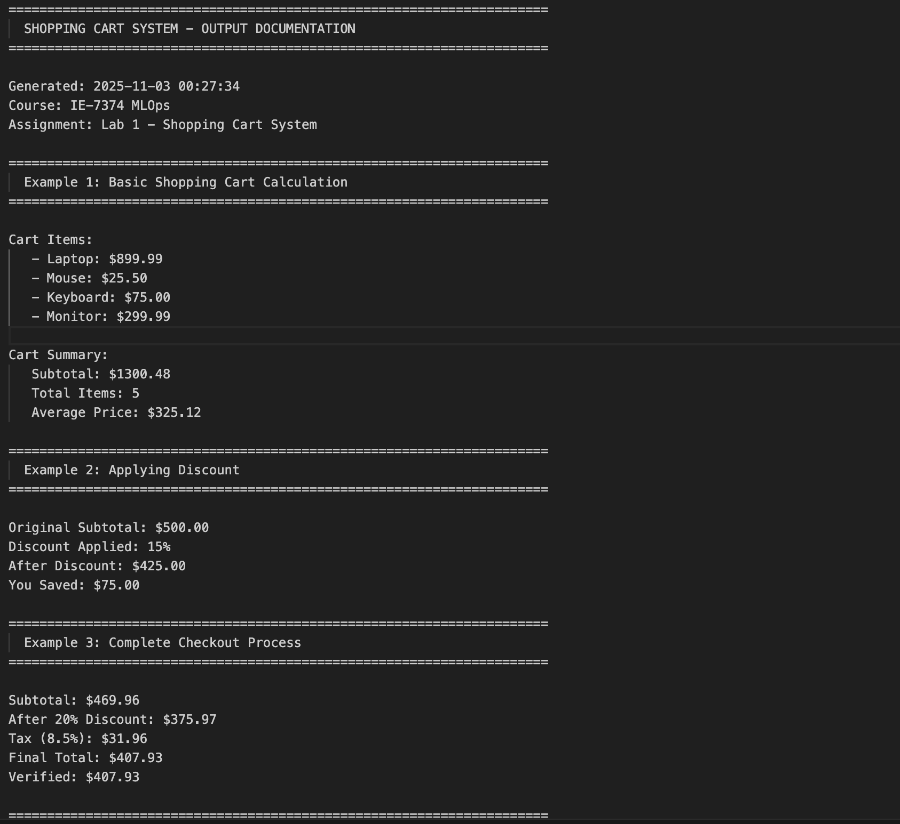
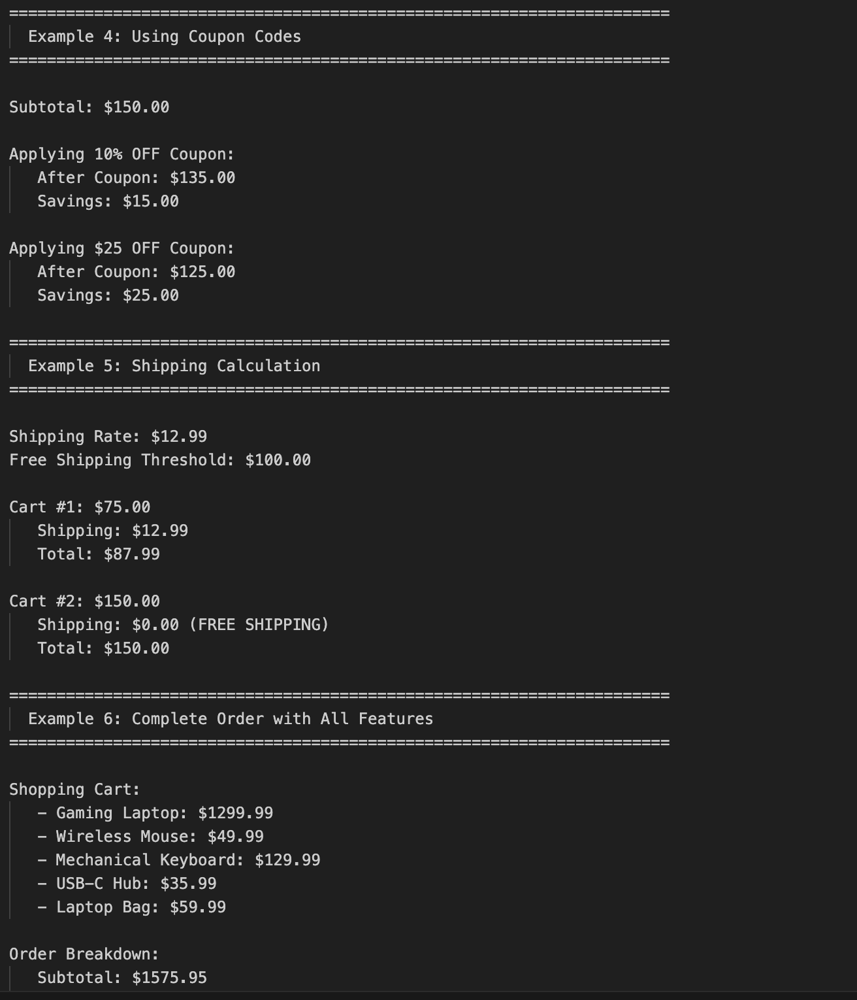
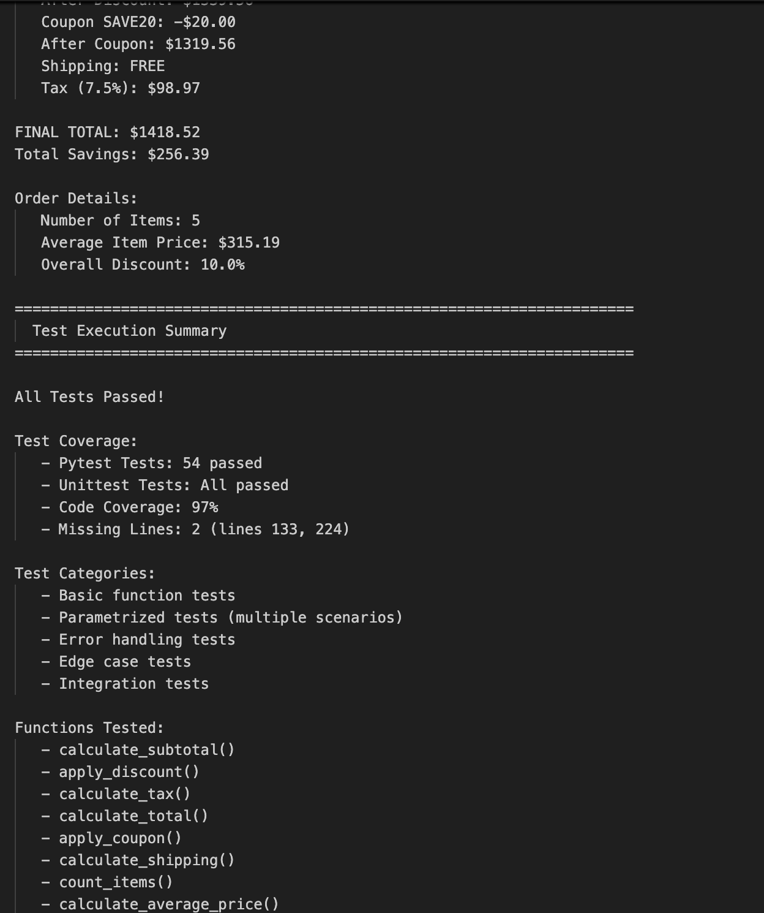
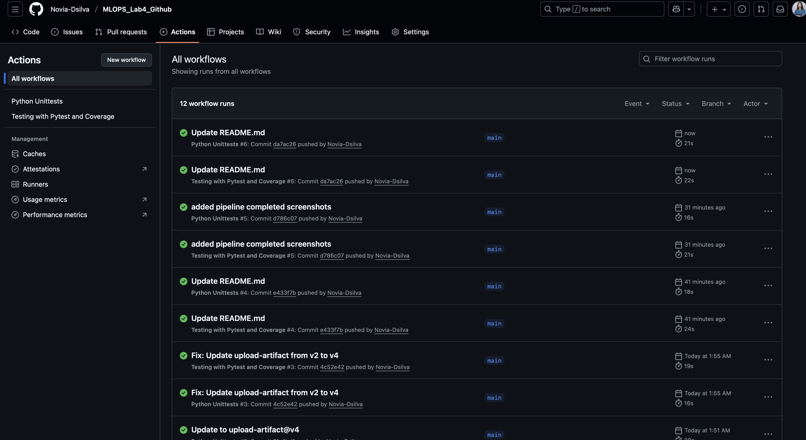
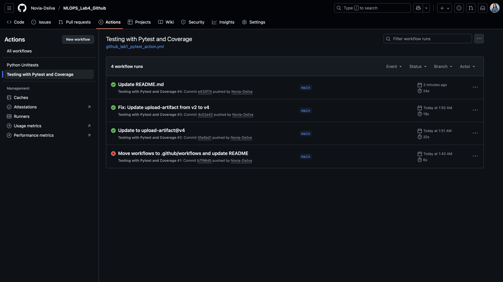
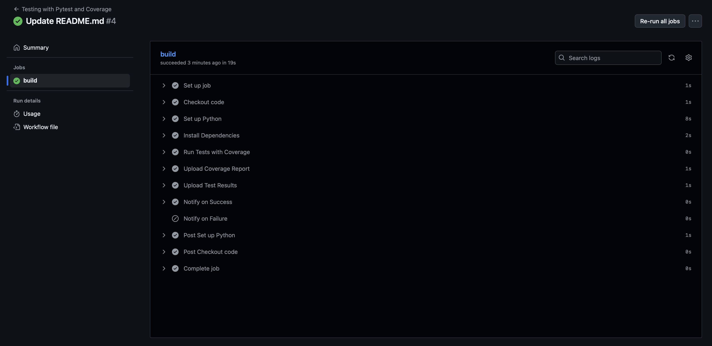
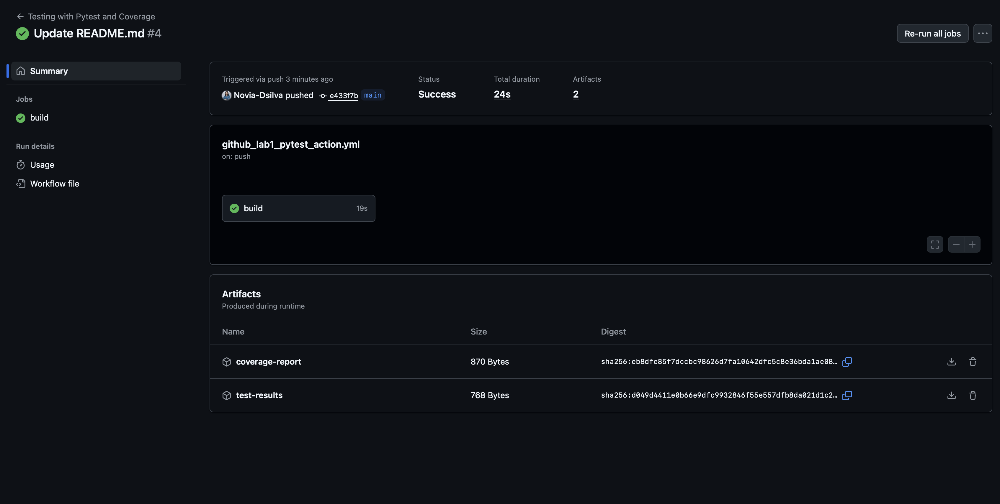
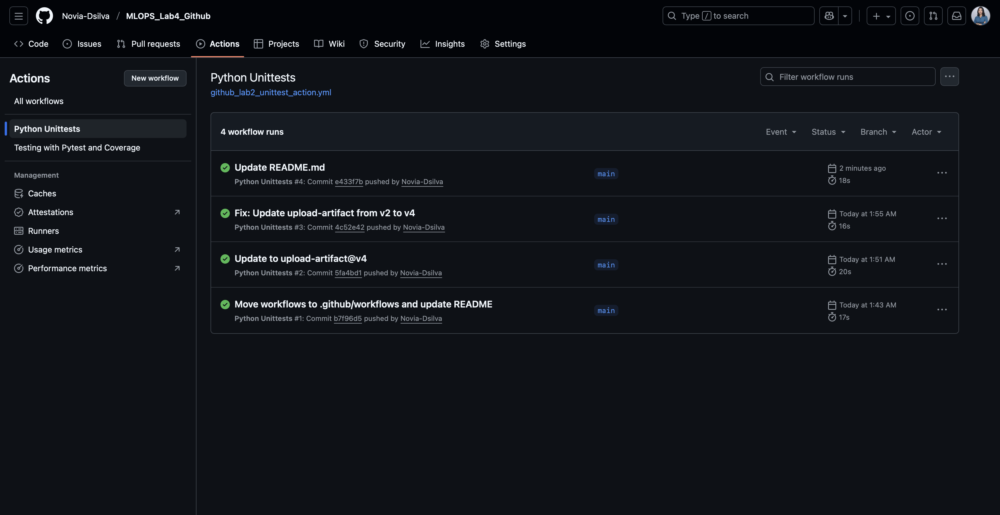
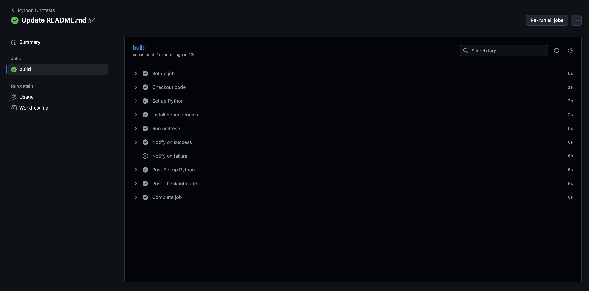

# LAB4 (Github Lab) - Shopping Cart System


[](https://github.com/Novia-Dsilva/MLOPS_Lab4_Github/actions/workflows/github_lab1_pytest_action.yml)
[](https://github.com/Novia-Dsilva/MLOPS_Lab4_Github/actions/workflows/github_lab2_unittest_action.yml)

## Modifications and Enhancements

This Assignment implements a **Shopping Cart System** instead of the basic calculator, demonstrating advanced MLOps practices and comprehensive testing strategies. Below are the key modifications made to the original lab requirements:

### 1. Enhanced Application - Shopping Cart System
**Original:** Basic calculator with 4 arithmetic functions (add, subtract, multiply, combine)

**Modified:** Complete e-commerce shopping cart system with 8 real-world functions:
- `calculate_subtotal()` - Sum all item prices
- `apply_discount()` - Apply percentage discounts
- `calculate_tax()` - Calculate sales tax
- `calculate_total()` - Complete checkout with discount and tax
- `apply_coupon()` - Apply percentage or fixed-amount coupons
- `calculate_shipping()` - Calculate shipping with free shipping logic
- `count_items()` - Count total items in cart
- `calculate_average_price()` - Calculate average item price

**Rationale:** Demonstrates more complex business logic and real-world application scenarios relevant to e-commerce platforms.

### 2. Comprehensive Testing with Parametrization
**Original:** Basic test cases for each function

**Modified:** 54 test cases including:
- Basic function tests
- **Parametrized tests** - Testing multiple scenarios in single test functions using `@pytest.mark.parametrize`
- Error handling tests - Validating all edge cases and exceptions
- Integration tests - Testing complete workflows
- **97% code coverage** achieved

**Example of parametrized test:**
```python
@pytest.mark.parametrize("subtotal, discount, expected", [
    (100, 10, 90.0),
    (50, 20, 40.0),
    (200, 0, 200.0),
])
def test_apply_discount_parametrized(subtotal, discount, expected):
    assert apply_discount(subtotal, discount) == expected
```

### 3. Enhanced GitHub Actions with Coverage Reporting
**Original:** Basic pytest and unittest workflows

**Modified:** Advanced CI/CD pipeline with:
- Code coverage reporting using `pytest-cov`
- Coverage artifacts uploaded to GitHub
- Detailed test execution reports
- Both pytest and unittest automation maintained

### 4. Output Documentation
**Added:** `generate_output.py` script that creates `OUTPUT.txt`

**Purpose:** 
- Automatically generates comprehensive output showing all functions in action
- Provides 6 different usage examples with real-world scenarios
- Displays test execution summary
- Allows reviewers to see results without running code

**Features:**
- Complete shopping cart workflows
- Discount and coupon applications
- Shipping calculations with free shipping logic
- Tax calculations
- Multi-step checkout processes

### 5. Professional Documentation
**Added:** 
- Comprehensive README with usage examples
- CONTRIBUTING.md for collaboration guidelines
- Detailed function docstrings with Args, Returns, and Raises sections
- Clear project structure documentation

### 6. Advanced Error Handling
**Enhancement:** All functions include robust input validation:
- Type checking for all parameters
- Range validation (e.g., discount must be 0-100%)
- Negative value prevention
- Clear, descriptive error messages

**Example:**
```python
if not isinstance(subtotal, (int, float)):
    raise ValueError("Subtotal must be a number.")
if subtotal < 0:
    raise ValueError("Subtotal cannot be negative.")
```

### 7. Real-World Business Logic
**Implementation:**
- Discounts applied before tax (industry standard)
- Free shipping threshold logic
- Coupon codes can't reduce total below zero
- Multiple discount types (percentage and fixed amount)
- Proper order of operations in checkout process

### Summary of Deliverables

| Component | Status | Enhancement |
|-----------|--------|-------------|
| Virtual Environment | Complete | As specified |
| GitHub Repository | Complete | As specified |
| Source Code | Enhanced | 8 functions vs 4 original |
| Pytest Tests | Enhanced | 54 tests with parametrization |
| Unittest Tests | Enhanced | Comprehensive coverage |
| GitHub Actions | Enhanced | Added coverage reporting |
| Documentation | Enhanced | Professional README + OUTPUT.txt |
| Code Coverage | Added | 97% coverage achieved |

---

## Project Overview

This lab demonstrates MLOps best practices including automated testing, continuous integration, code coverage analysis, and professional documentation standards through the implementation of a shopping cart system.

---

## Step 1: Creating a Virtual Environment

In software development, it's crucial to manage project dependencies and isolate your project's environment from the global Python environment. This isolation ensures that your project remains consistent, stable, and free from conflicts with other Python packages or projects. To achieve this, we create a virtual environment dedicated to our project.

To create a virtual environment, follow these steps:

1. Open a Command Prompt or Terminal in the directory where you want to create your project.
2. Choose a name for your virtual environment (e.g "lab_01") and run the appropriate command:
    ```bash
    python -m venv lab_01
    ```
3. Activate the virtual environment
    ```bash
    # Windows
    lab_01\Scripts\activate
    
    # Mac/Linux
    source lab_01/bin/activate
    ```
After activation, you will see the virtual environment's name in your command prompt or terminal, indicating that you are working within the virtual environment.

---

## Step 2: Creating a GitHub Repository, Cloning and Folder Structure

Now that we have set up our virtual environment, the next step is to create a GitHub repository for our project and establish a structured folder layout. This organization helps maintain your project's code, data, and tests in an organized manner.

### Creating a GitHub Repository
- Open a web browser and go to GitHub.
- In the upper right corner, click the "+" button and select "New repository."
- Choose a name for your repository.
- Choose the visibility of your repository—either public (visible to everyone) or private (accessible only to selected collaborators)
- Check the "Initialize this repository with a README" box. This will create an initial README file that you can edit to provide project documentation.
- Click the "Create repository" button.

### Cloning the Repository
- Open a Command Prompt or Terminal.
- Navigate to the directory where you want to clone your GitHub repository. This should be the same directory where you created your virtual environment.
- Run the following command to clone your GitHub repository into the current directory:
    ```bash
    git clone <repository_url>
    ```
- Replace `<repository_url>` with the URL of your GitHub repository. You can find this URL on your GitHub repository's main page.
After running the command, the repository will be cloned, and you'll have a local copy of your GitHub project in your chosen directory.

### Establishing Folder Structure
Once you have cloned your repository, you can establish a structured folder layout within it. This layout helps organize your project into key directories for code, data, and tests. Create the following subfolders within your repository:

```
Lab1/
├── .github/
│   └── workflows/
│       ├── github_lab1_pytest_action.yml
│       └── github_lab2_unittest_action.yml
├── assets/
│   ├── S1.png
│   ├── S2.png
│   └── S3.png
├── data/
│   └── __init__.py
├── src/
│   ├── __init__.py
│   └── shopping_cart.py
├── test/
│   ├── __init__.py
│   ├── test_pytest.py
│   └── test_unittest.py
├── .gitignore
├── requirements.txt
├── generate_output.py
├── OUTPUT.txt
└── README.md
```

- **data:** This folder is used for storing project data files or datasets.
- **src:** This folder is where you'll store your project's source code files.
- **test:** This folder is dedicated to unit tests and test scripts for your code.
- Create a file named `.gitignore`. This is useful to exclude the virtual environment and other unnecessary files from version control.
- Add the virtual environment folder name inside your gitignore file so that its not tracked by Git.

### Adding and Pushing Your Project Code to GitHub
Now that we have our virtual environment set up, the GitHub repository created, and the folder structure organized, let's add our project's code and push it to GitHub.

**Adding Your Project Code**
- Navigate to your project directory using the Command Prompt or Terminal, where you have the virtual environment and folder structure set up.
- Create and write your Python code or other project files within the specified directories (src, data, etc.) according to your project requirements.
- Once your project files are ready, it's time to add them to Git's staging area. In your project directory, run the following command:
    ```bash
    git add .
    ```
- This command stages all the changes and new files in your project directory for the next commit.

**Committing Your Changes**
- After staging your changes, commit them with a meaningful commit message that describes the changes you made. Replace `<your_commit_message>` with a descriptive message:
    ```bash
    git commit -m "<your_commit_message>"
    ```

**Pushing to GitHub**
- To push your committed changes to your GitHub repository, use the following command:
    ```bash
    git push origin main
    ```

---

## Step 3: Creating shopping_cart.py in src Folder

In this step, we create a Python script named `shopping_cart.py` within the src folder of your project. This script contains a set of e-commerce functions designed to perform shopping cart operations.

### Functions Implemented:

1. **calculate_subtotal(prices)** - Calculates the sum of all item prices
2. **apply_discount(subtotal, discount_percent)** - Applies percentage discount to subtotal
3. **calculate_tax(amount, tax_rate)** - Calculates sales tax on given amount
4. **calculate_total(subtotal, discount_percent, tax_rate)** - Calculates final total with discount and tax
5. **apply_coupon(subtotal, coupon_value, is_percentage)** - Applies coupon codes (percentage or fixed)
6. **calculate_shipping(subtotal, shipping_rate, free_shipping_threshold)** - Calculates shipping cost with free shipping logic
7. **count_items(quantities)** - Counts total number of items in cart
8. **calculate_average_price(prices)** - Calculates average price of items

All functions include comprehensive error handling, input validation, and detailed docstrings.

> **Note:** Whenever you want to push files to your repository follow the steps in [Adding and Pushing Your Project Code to GitHub](#adding-and-pushing-your-project-code-to-github)

---

## Step 4: Creating tests using Pytest and Unittests

In this step, we'll set up unit tests for the functions in our `shopping_cart.py` script using two popular testing frameworks: [pytest](https://docs.pytest.org/en/7.4.x/) and [unittest](https://docs.python.org/3/library/unittest.html). Unit testing ensures that individual components of your code work as expected, helping you catch and fix bugs early in the development process.

### Using Pytest

**Installation:**
```bash
pip install pytest pytest-cov
```

### Writing Pytest Tests

- Pytest makes it easy to write tests for your Python code. Tests are written as regular Python functions, and test file names typically start with `test_` or end with `_test.py`.
- To run your Pytest tests, you can use the pytest command:
    ```bash
    pytest test/test_pytest.py -v
    ```
- To run with coverage:
    ```bash
    python -m pytest test/test_pytest.py --cov=src --cov-report=term-missing -v
    ```

**Parametrized Tests:**
This project uses parametrized tests extensively, allowing the same test function to run with multiple sets of inputs:

```python
@pytest.mark.parametrize("subtotal, discount, expected", [
    (100, 10, 90.0),
    (50, 20, 40.0),
    (200, 0, 200.0),
])
def test_apply_discount_parametrized(subtotal, discount, expected):
    assert apply_discount(subtotal, discount) == expected
```

**Test Coverage:** 54 pytest tests covering all functions, edge cases, and error conditions.

### Writing Tests with UnitTest

- Unittest allows you to write tests as classes that inherit from the `unittest.TestCase` class.
- To run Unittest tests:
    ```bash
    python -m unittest test.test_unittest -v
    ```

- Unittest provides assertion methods such as `assertEqual`, `assertTrue`, `assertFalse`, and `assertRaises` to validate test conditions.
- The `test_unittest.py` file contains comprehensive test cases mirroring the pytest implementation.

---

## Step 5: Implementing GitHub Actions

GitHub Actions is a powerful automation and CI/CD (Continuous Integration/Continuous Deployment) platform provided by GitHub. It enables you to automate various workflows and tasks directly within your GitHub repository.

### How GitHub Actions Work:

- **Events:** Specific activities that occur within your GitHub repository, such as code pushes or pull requests.
- **Actions:** Individual tasks or steps defined in a workflow file.
- **Triggers:** Conditions that cause a workflow to run.

### The Purpose of GitHub Actions:

- **Automation:** Reduces manual effort and ensures consistency
- **Continuous Integration (CI):** Automatically build, test, and validate code changes
- **Continuous Deployment (CD):** Enable automatic deployment when changes are merged

### Creating GitHub Actions Workflow Files:

Two workflow files are created under the `.github/workflows` directory:

**1. github_lab1_pytest_action.yml** - Pytest with Coverage

This workflow:
- Triggers on push to main branch
- Sets up Python 3.8 environment
- Installs dependencies from requirements.txt
- Runs pytest with coverage reporting
- Generates coverage report (97% coverage achieved)
- Uploads test results and coverage as artifacts
- Notifies on success/failure

**2. github_lab2_unittest_action.yml** - Unittest Automation

This workflow:
- Triggers on push to main branch
- Sets up Python 3.8 environment
- Installs dependencies
- Runs unittest test suite
- Notifies on success/failure

Both workflows ensure code quality by automatically running all tests on every push or pull request.

---

## Step 6: Generating Output Documentation

### Running the Output Generator

To generate comprehensive output documentation:

```bash
python generate_output.py
```

This creates `OUTPUT.txt` containing:
- 6 complete usage examples
- Real-world shopping cart scenarios
- Test execution summary
- Coverage report details

**Sample Output:**





The OUTPUT.txt file demonstrates all functions working correctly with various test cases and edge conditions.

---

### GitHub Actions Pipeline Results

**Complete Actions Dashboard:**


*Both pytest and unittest workflows running automatically on every push*

**Pytest Workflow Success:**








**Unittest Workflow Success:**





---

## Running Tests Locally

```bash
# Activate virtual environment
lab_01\Scripts\activate  # Windows
source lab_01/bin/activate  # Mac/Linux

# Run pytest
pytest test/test_pytest.py -v

# Run pytest with coverage
python -m pytest test/test_pytest.py --cov=src --cov-report=term-missing -v

# Run unittest
python -m unittest test.test_unittest -v

# Generate output documentation
python generate_output.py
```

---

## Test Results Summary

- **Total Tests:** 54 (pytest) + comprehensive unittest suite
- **Test Status:** All passing
- **Code Coverage:** 97%
- **Parametrized Tests:** Multiple scenarios tested per function
- **Error Handling:** All edge cases validated

---

## Technologies Used

- Python 3.8+
- Pytest (testing framework)
- pytest-cov (coverage analysis)
- Unittest (Python's built-in testing)
- GitHub Actions (CI/CD automation)
- Git (version control)

---

## Project Features

- Comprehensive shopping cart functionality
- Robust error handling and input validation
- 97% test coverage
- Parametrized testing for multiple scenarios
- Automated CI/CD pipeline
- Professional documentation
- Real-world business logic implementation

---
**Novia Dsilva**
- Course: IE-7374 MLOps
- Assignment4(Github Lab): - Shopping Cart System

---
